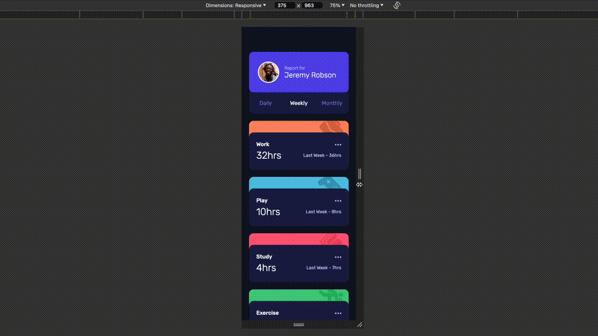
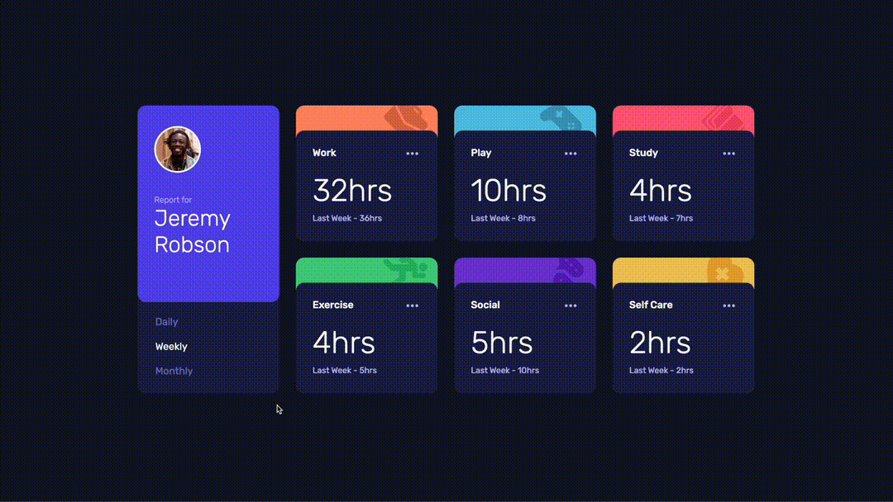

# Time Tracking Dashboard

This is my solution to the [Time tracking dashboard challenge on Frontend Mentor](https://www.frontendmentor.io/challenges/time-tracking-dashboard-UIQ7167Jw).

## Table of contents

- [Overview](#overview)
  - [The challenge](#the-challenge)
  - [Screenshot](#screenshot)
  - [Links](#links)
- [My process](#my-process)
  - [Built with](#built-with)
  - [What I learned](#what-i-learned)

## Overview

### The challenge

Users should be able to:

- View the optimal layout for the site depending on their device's screen size
- See hover states for all interactive elements on the page
- Switch between viewing Daily, Weekly, and Monthly stats

### Screenshot

Here is the outcome of my solution, which is compatible with various platforms and sizes:

- Responsiveness

- Time tracking dashboard

### Links

- Solution URL: [https://github.com/rainof/time-tracking-dashboard-project](https://github.com/rainof/time-tracking-dashboard-project)
- Live Site URL: [https://rainof.github.io/time-tracking-dashboard-project](https://rainof.github.io/time-tracking-dashboard-project)

## My process

### Built with

- Semantic HTML5 markup
- CSS custom properties
- [Flexbox](https://developer.mozilla.org/en-US/docs/Learn/CSS/CSS_layout/Flexbox/)
- [CSS Grid](https://developer.mozilla.org/en-US/docs/Learn/CSS/CSS_layout/Grids)
- [Mobile-first workflow](https://developer.mozilla.org/en-US/docs/Glossary/Mobile_First)
- [ReactJS](https://reactjs.org/)

### What I learned

- Set up the project using React with a mobile-first design approach.
- Broke down components into smaller pieces and organized the file structure.
- Designed responsive layouts to transition smoothly from mobile to desktop views.
- Built features to switch views between daily, weekly, and monthly, and implemented hover states for all interactive elements.
- Used Figma for closer alignment with the design.
